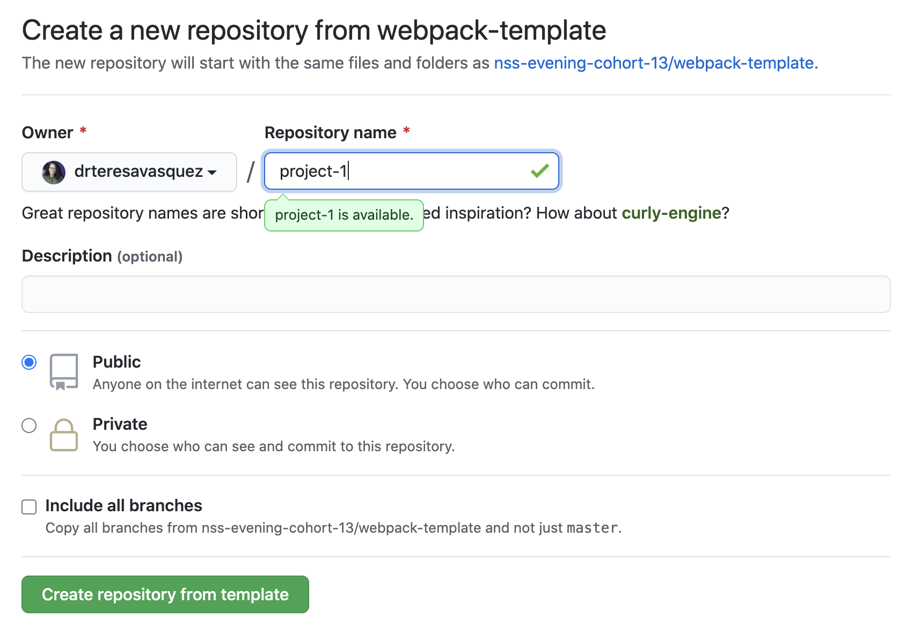
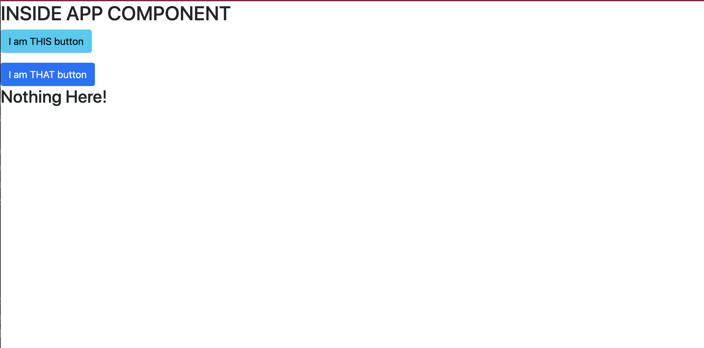

# React Hoarder

> You are a hoarder. But not just any hoarder. You are an arrogant hoarder who wants to show off all of the stuff you hoard. You want an application that gives you a list of anything possible to hoard, and add them to your own personal collection as you acquire them.


## Data
[Use this JSON file to seed your "items" collection in Firebase.](./items.json)


## Assignment Parts

# React Hoarder Part 1: Authentication and Routing

## User Stories - Authentication

* As a user, if I go to the application and I am not logged in, I should see a google authentication button.
* As a user, I should be able to authenticate via google.
* As a user, I should always see a navbar.
* As a user, when I am logged out, the navbar should only display the brand name.
* As a user, when I am logged in, the navbar should display links to home, My Stuff, New, and logout.
* As a user, when I click the logout button in the navbar I should be logged out and should see the google authentication button.

## User Stories - Routing
* As a user if I click the home link in the navbar, I should navigate to '/home'  and see an h1 tag that says 'Home'.
* As a user if I click the New link in the navbar, I should navigate to '/new'  and see an h1 tag that says 'New Stuff'.
* As a user if I click the My Stuff link in the navbar, I should navigate to '/stuff'  and see an h1 tag that says 'My Stuff' and two buttons - on that says Edit and one that says Single.
* As a user when I click the Edit button on the My Stuff page I should be redirect to '/edit/12345' and I should see an h1 tag that says 'Edit';
* As a user when I click the Single button on the My Stuff page I should be redirect to '/stuff/12345' and I should see an h1 tag that says 'Single Stuff';

# React Hoarder Part 2: CRUD on Items

## User Stories

### CREATE
* As a user, when I click New in the navbar I should be taken to the '/stuff/new' page where I should see a form for adding new items.
* As a user, when I add in details and hit save on the '/stuff/new' page my item should save to firebase and I should be redirected to '/stuff'.

### READ
* As a user, when I navigate to the /stuff route, I should see a "My Stuff" page. This page should have a list of all of the items I have hoarded.
* As a user, when I click on an item on the My Item page, I should be taken to the Single Item page and see details for that item

### UPDATE
* As a user, when I click a update button on the My Stuff page, I should be redirected to the edit page and should see a form pre-populated with all the information for the item I am editing.  Once I make edits and push the save button, Firebase should edit and I should be redirected to the '/stuff' page.
* As a user, when I click a update button on the Single Item page, I should be redirected to the edit page and should see a form pre-populated with all the information for the item I am editing.  Once I make edits and push the save button, Firebase should edit and I should be redirected to the '/stuff' page.

### DELETE
* As a user, when I click a delete button on the My Stuff page, the item should be removed from firebase and I should no longer see it.
* As a user, when I click a delete button on the Single Item page, the item should be removed from firebase and I should no longer see it, and I should be redirected to the My Stuff page.

---

# Use this template
This template includes all the dependencies and set up needed for you to work within defined code standards and structure to get you up and running quickly.

## Topics
- [Get Started](#get-started)
- [Starting the Project](#starting-the-project)
- [Other important tidbits](#other-important-tidbits)
    - [React Dev Tools](#react-dev-tools)
    - [Using axios](#using-axios)
    - [Deploying on Netlify](#deploying-on-netlify)
___

## Get Started
### Use Template
#### 1. To get started, click the GREEN "Use this Template" button at the top of the repo


#### 2. Make sure YOUR github account is selected in the dropdown and name your project


3. Clone your new repo to your local machine
4. Go to the **NEXT** section

## Starting the Project
1. Open the `package.json` file and change the `name` property to the name of your application, and `author` to  your name
1. Open the `/public/index.html` file and change the `title` attribute to the name of your application
1. Rename the `.env.local.sample` file to `.env.local` file. The final file name should be `.env.local`
1. From your command line, be in the root directory and run `npm install` OR `npm i` for short
1. From your command line, be in the root directory and run `npx husky install`
1. To start your application, run `npm start`

### If you see this, you are set to go!


**NOTES:** 
- Changes you make to the project will make the browser reload on save...no more hard refresh unless something goes wrong.

## Other Important Tidbits
### React Dev Tools
From this time forward, you will be expected to have a clean console in order for your assignments to be approved. Use [React Developer Tools Chrome Extension](https://chrome.google.com/webstore/detail/react-developer-tools/fmkadmapgofadopljbjfkapdkoienihi?hl=en) to help with debugging.
### Including Images with React
If you have a folder of local images that you want to load into your code things get a little strange with webpack.  Remember the only way webpack knows about assets is if they are imported into your javascript files.  Even our CSS is not added until those files are imported into our javascript files.  Below is some sample code for how to load a local image file into your project

```js
import cat from './assets/cat.jpg';

<>
  
</>

```
### Using Axios
> For every file you will need to make an API request in, you will need to import Axios
```js
import axios from 'axios';

const examplePromise = () => {
  axios.get('http://localhost:3001/example')
    .then((data) => {
      console.warn(data);
    })
    .catch((error) => {
      console.error(error);
    });
});
```

### Deploying on Netlify

- Build Command: `yarn build`
- Publish directory: `build`
- **Add Environmental Variables (NOT REQUIRED for Apps that do not use API Keys, etc)**
    - Any Enviromental variables you are using in your `.env.local` file should be added to Netlify. 
        - Go to Site settings > Build & deploy > Environment > Environment variables and the keys and values there.
- **Update Firebase URL Settings**
    - In Firebase under Authentication select sign in methods, scroll to Authorized domains. Add your Netlify URL.
# Your own learning
If you are interested in setting up your own project for things outside of class, you can run the command to start a React project `npx create-react-app {APP_NAME}` and setup all the files and structures from scratch.
